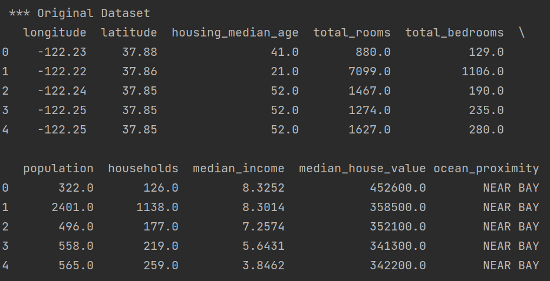

# PHW-2 디스크립션

Created: 2022년 10월 15일 오후 1:51
Last Edited Time: 2022년 10월 15일 오후 2:04

1. Source Code - Description
    
    ### Function : Cleaning_data(df)
    
    Output the original data set and check if there is a miss value in the data set. The miss value is solved by calculating the median of the feature that contains the miss value and inserting the median value into the missed value instead.
    
    • Parameter::	df : dataframe Dataset parameter
    • Returns::	params : dataframe Dataset with miss values resolved
    
    ### Function : Encoder(data, case, index)
    
    Depending on the case argument input, one of Label Encoder, Get Dummies, and One Hot Encoding is selected and encoded. The index argument means the index of the feature to which encoding is to be applied.
    
    • Parameters::	data : dataframe, case : int, index : list If case is 1, Label Encoder is selected to encode the index of data and return the data that is applied encoded index. If case is 2, Get Dummies is selected to encode the index of data and return the data that is applied encoded index. If case is 3, One Hot Encoding is selected to encode the index of data and return the data that is applied encoded index.
    • Returns::	params : dataframe Dataset with that encoding applied
    
    ### Function : Scaler(data, case)
    
    One of Standard Scaler, Min Max Scaler, and Robust Scaler is selected according to the case argument input, and the data is scaled. And plot the data before scaling and the scaled data
    
    • Parameters::	data : dataframe, case : int
    If case is 1, Standard Scaler is selected, scales the data and returns the result.
    If case is 2, Min Max Scaler is selected, scales the data and returns the result.
    If case is 3, Robust Scaler is selected, scales the data and returns the result.
    
    ### Function : Make_model(K, data, case, **kwargs)
    
    Function for make cluster model
    
    • Parameters::	K : int, data : dataframe, case : int, **kwargs
    K = cluster_num, data = dataset, case = switch value, kwargs = python dictionaly for cluster model parameter
    
    ### Function : model_train(data, model, case, name)
    
    Function for make cluster model
    
    • Parameters::	data : dataframe, model : model, case : int, name : list
    data = dataset, model = clustering model object, case = switch value
    
    ### Function : draw_median_test(labeleddata)
    
    Function for draw Compare plot with N (2,4,6,8,10) quantiles of medianHouseValue
    
    • Parameters::	labeleddata : dataframe
    
2. output result
    
    
    
    
    
    
    
    
    
    
    
    
    
    
    
    
    
    
    
    
    
    
    
    ## Result- Make_model(4,encoded_data1,2)
    
    
    
    
    
    
    
    ### Result - Make_model(4,encoded_data1,3,eps=100.0)
    
    
    
    ### Result - Make_model(4,encoded_data2,1)
    
    
    
    ### Result - Make_model(5,encoded_data1,0)
    
    
    
    ### The resulting output is too large, so we omiited a part of the plot.
    
    The omitted plot output can be seen at the link below.
    
    [https://colab.research.google.com/drive/1kI1iwBYqcP_2KxeP5c5esSZI_d6Patk5?usp=sharing#scrollTo=EJDbP5yYEIQj](https://colab.research.google.com/drive/1kI1iwBYqcP_2KxeP5c5esSZI_d6Patk5?usp=sharing#scrollTo=EJDbP5yYEIQj)
